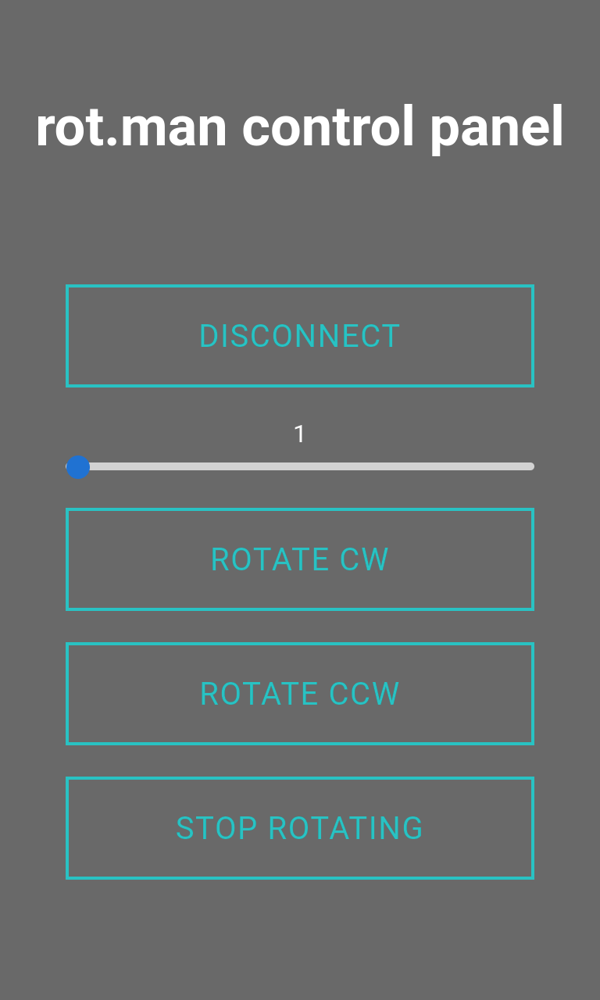

# rot.man stepper motor control
This is rot.man. It combines a Progressive Web App (PWA) and an Arduino to control a stepper motor wireless over Bluetooth. Why? Because it's nice to have a rotating GoPro mount to shoot a range of timelapse photos. Bonus: The PWA can run on a smartphone and control the motor even when the phone is offline.

The slider configures the rotation speed: 1 is for 1 minute to rotate 360 degrees, 60 would take an hour. rot.man can rotate clockwise and counterclockwise.

## HW requirements
- Arduino Pro Mini, although other models should also work
- Stepper motor 28BYJ-48 with ULN2003 driver board
- Bluetooth module HC-06, or some similar one
- A 5V power supply, some jumper wires, soldering iron
- UART adapter to connect the Arduino to the PC

## SW requirements
- A browser that supports PWAs (Chrome does)
- Up-to-date Arduino IDE to flash the sketch onto the Pro Mini
- A running webserver or PaaS (like Heroku) to serve the PWA
- ... or simply use https://rotman.herokuapp.com

## Setup
- Wire everything as per the diagram (tba)
- Flash the rotman.ino sketch file onto the Arduino
- To run the PWA, these files need to be served:
  - common.css
  - composer.json &larr; when deploying to Heroku
  - icon-512.png
  - index.html
  - main.js
  - manifest.json
  - sw.js

## Run
- Power the Arduino, it should be discoverable via BT, device name: rot.man
- Launch a browser that supports PWAs and navigate to the PWA
- You may add the PWA to the home screen of your phone at this point
- Hit the connect button to find the rot.man device and pair it ...

## Further remarks
- There will be a Dockerfile soon to run the PWA containerized
- This is a hobby project, it's just a prototype for now, use at your own risk!
